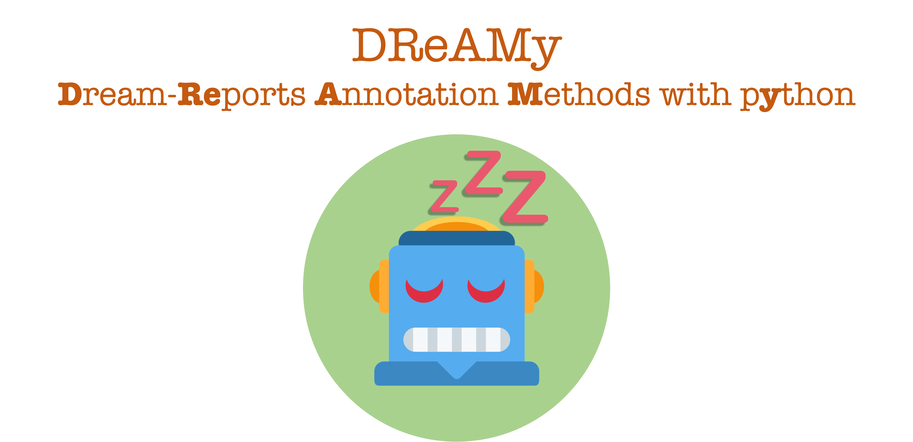

DReAMy is a python library to automatically analyse (for now only) textual dream reports. At the moment, annotations are based on different [Hall & Van de Castle](https://link.springer.com/chapter/10.1007/978-1-4899-0298-6_2) features (e.g., character, emotions), but we are looking forward to expanding DReAMy's capabilities.  For more details on the theoretical aspect, please refer to the [pre-print](https://arxiv.org/abs/2302.14828). You can also follow us on [Twitter](https://twitter.com/DreamyLib), to keep up with updates and relevant work!

For more details on the theretcal aspect, please refer to the .

# Installation and usage
DReAMy can be easily installed via pip, and we do recommend using a virtual environment with python 3.9 or 3.10 installed. If you wish to play/query DReAMy's model, you can do so using the 🤗 Space [`DReAM`](https://huggingface.co/spaces/DReAMy-lib/dream).

```
pip install dreamy
```

# Current Features
At the moment, DReAMy has three main features: 
- Data: download datasets, containing dream reports from DreamBank.
- Analyse: collect (contextualised) embeddings, dimensionality reduction, clustering. ([Colab tutorial](https://colab.research.google.com/drive/1wqRv18C5d9yNo6IXL-EB6OEqWmv5qYSF))
- Annotate: label dream reports following different HVDC features, using one of three tasks – entity recognition, sentiment analysis, and relation extraction. ([Colab tutorial](https://colab.research.google.com/drive/1USNfEy0VmOYxH8sDIItEVbS816XX8Zvh))

Usage examples of all features can be found in the code below, and in the tutorials in the dedicated folder. 

## Data
DReAMy has direct access to two datasets. A smaller English-only (~ 22k), with more descriptive variables (such as gender and year of collection), and a larger one (~ 30k), with reports both in english and german. You can download them using the simple code below.
```py
import dreamy

# choose between base (~ 22k reports, EN-only & more descriptive variables) 
# large (~ 29k reports, reports in EN and De, only series as descriptive variables)
database  = "base" 
dream_bank = dreamy.get_HF_DreamBank(database=database, as_dataframe=True)

dream_bank.sample(2)
```
|index|series|description|dreams|gender|year|
|---|---|---|---|---|---|
|5875|blind-f|Blind dreamers \(F\)|I'm at work in the office of a rehab teacher named D, a transistor radio is on, I held it in my hand and placed it on my desk\. [...]\.|female|mid-1990s|
|12888|emma|Emma: 48 years of dreams|I go to Pedro's house, he is fixing his bike\. [...]|female|1949-1997|

## Analyse
You can also use DReAMy to easily extract, reduce, cluster, and visualise (contextualised) encodings (i.e., vector embeddings) of dream reports, with few and simple lines of code. At the moment, you can choose between four models, which are combinations of small/large English-only/Multilingual models.

```py
import dreamy

# Get some data in a list form
list_of_reports = dream_bank["dreams"].tolist()

# set up model and  get encodings
model_size = "small"   # or large
model_lang = "english" # or multi, for multilingual
device     = "cpu"     # se to "cuda" for GPUs

report_encodings = dreamy.get_encodings(
    list_of_reports, 
    model_size=model_size,
    language=model_lang, 
    device=device,
)

# reduce space
# you can choose between pca/t-sne
X, Y = dreamy.reduce_space(report_encodings, method="pca") 

# Update your original dataframe with cohordinates and plot
dream_bank["DR_X"], dream_bank["DR_Y"] = X, Y
```
You can then use your favourite library to visualise the results.

## Annotate

As mentioned, the Annotate features revolves around three tasks:

- NER : (name entity recognition) which annotates reports with respect to the character appearing in a report.

- SA: (sentiment analysis) which annotates reports with respect to which of the five Hall & Van de Castle emotions (anger, apprehension, confusion, sadn4ssm happiness) appear in a report (possibly, also which character is experiencing them)

- RE: (relation extraction), which extracts entities (characters) in a report and the relation between them. At the moment, the only RE task available refers to the activity feature of the HVDC framework.

All the task are handelled via the main `annotate_reports` method, and can be called by simply changing the `task` argument. Check the dedicated tutorial for more.

```py
task        = "SA"
batch_size = 16
device     = "cpu"  # or "cuda" / device number (e.g., 0) for GPU

SA_predictions = dreamy.annotate_reports(
    list_of_reports, 
    task=task, 
    device=device,
    batch_size=batch_size, 
)

SA_predictions
```

```
[[{'label': 'SD', 'score': 0.9931567311286926},
  {'label': 'HA', 'score': 0.08149773627519608},
  {'label': 'CO', 'score': 0.04012126475572586},
  {'label': 'AN', 'score': 0.007265480700880289},
  {'label': 'AP', 'score': 0.006692806258797646}],
  ...
```
Please refer to the tutorial(s) for more infomation and detials. 

# In-Progress Development
## Audio-to-Text pipeline

# Planned Development
## EEG interface
## Topic-Modelling

## Contribute
If you wish to contribute, collaborate, or just ask question, feel free to contact [Lorenzo](https://lorenzoscottb.github.io/), or use the issue section.

## Cite 
If you use DReAMy, please cite the work
```bibtex
@misc{https://doi.org/10.48550/arxiv.2302.14828,
  doi = {10.48550/ARXIV.2302.14828},
  url = {https://arxiv.org/abs/2302.14828},
  author = {Bertolini, Lorenzo and Elce, Valentina and Michalak, Adriana and Bernardi, Giulio and Weeds, Julie},
  keywords = {Computation and Language (cs.CL), FOS: Computer and information sciences, FOS: Computer and information sciences},
  title = {Automatic Scoring of Dream Reports' Emotional Content with Large Language Models},
  publisher = {arXiv},
  year = {2023},
  copyright = {Creative Commons Attribution 4.0 International}
}
