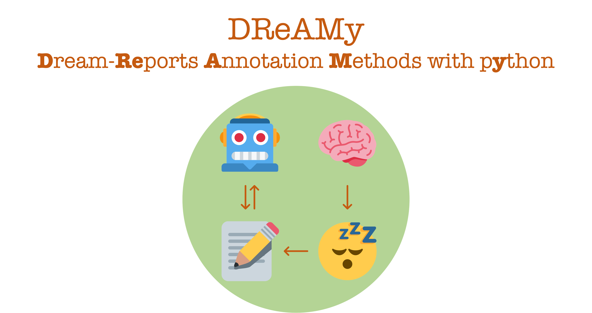

DReAMy is a python library to automatically analyse (for now only) textual dream reports. At the moment, annotations are exclusively based on the [Hall & Van de Castle](https://link.springer.com/chapter/10.1007/978-1-4899-0298-6_2) emotions framework, but we are looking forward to expanding our set applications. As for the theoretical backbone, DReAMy and its model are based on a fruitful collaboration between NLP and sleep research. For more details, please refer to the [pre-print](https://arxiv.org/abs/2302.14828)

# Installation and usage
DReAMy can be easily installed via pip, and we do recommend using a virtual environment with python 3.9 installed. If you wish to play/query a set of DReAMy's model, you can do so using the [`DReAMv.1`](https://huggingface.co/spaces/DReAMy-lib/dream) 🤗 Space.
```
pip install dreamy
```

# Current Features
At the moment, DReAMy has four main features: 
- Dataset, allowing to download and use of two dream-report datasets from DreamBank.
- Sentiment Analysis, allowing easily classify lists of reports for HVDC emotions.
- NER (or character annotation), allowing the extraction of relevant characters appearing in a given report. 
- Encodings: that easily collects and explores (contextualised) embeddings of textual reports.

Usage examples can be found in the code below, and in the tutorial folder. 

## Dataset
DReAMy has direct access to two datasets. A smaller English-only (~ 20k), with more descriptive variables (such as gender and year of collection), and a larger one (~ 30k), with reports both in english and german. You can download them using the simple code below.
```py
import dreamy

language   = "english" # choose between english/multi
dream_bank = dreamy.get_HF_DreamBank(as_dataframe=True, language=language)

dream_as_list = dream_sample["dreams"].tolist()

dream_bank.sample(2)
```
|index|series|description|dreams|gender|year|
|---|---|---|---|---|---|
|5875|blind-f|Blind dreamers \(F\)|I'm at work in the office of a rehab teacher named D, a transistor radio is on, [...]\.|female|mid-1990s|
|12888|emma|Emma: 48 years of dreams|I go to Pedro's house, he is fixing his bike\. I think I will take my bike out too[...]\!|female|1949-1997|

## Sentiment Analsyis (SA)
The sentiment analysis methods allow you to annotate a set of reports with respect to the emotion feature of the [Hall & Van de Castle](https://dreams.ucsc.edu/Coding/) scoring system. At the moment, DReAMy has two formats of SA: multi-label classification, and generation.

### Multi-Label Classification  
As suggested by the name, MLC models are tuned to classify a report in terems of (the probability of the) ptesence of each HVDC emotion (i.e., anger, apprehension, sadness, confusion, happiness). You can choose between two mlc LLMs at the moment: `base-en` and `large-multi` (a XLM-R-large). The code below showcase how to use the `.predict_emotions` method to annotate a list of reports.
```py 
classification_type = "presence"
model_type          = "base-en"
return_type         = "distribution" # set "present" for above-threshold only
device              = "cpu"

predictions = dreamy.predict_emotions(
    dream_as_list, 
    classification_type, 
    model_type,
    return_type=return_type, 
    device=device,
)

predictions
```
```
[[{'label': 'CO', 'score': 0.7488341331481934},
  {'label': 'HA', 'score': 0.09567967802286148},
  {'label': 'AN', 'score': 0.03418444097042084},
  {'label': 'AP', 'score': 0.019197145476937294},
  {'label': 'SD', 'score': 0.012466167099773884}],
 [{'label': 'HA', 'score': 0.9818947911262512},
  {'label': 'SD', 'score': 0.03642113506793976},
  {'label': 'AP', 'score': 0.03470420092344284},
  {'label': 'CO', 'score': 0.024184534326195717},
  {'label': 'AN', 'score': 0.023663492873311043}]
```
To decode each label's acronim, you can call a HVDC conversion table with 
```py
dreamy.Coding_emotions
```
```
{'AN': 'anger',
 'AP': 'apprehension',
 'SD': 'sadness',
 'CO': 'confusion',
 'HA': 'happiness'}
```
### Generation
Pretty straightforwardly, under this format, an LLM (`T5-base`) was tuned to generate emotion-based reports. The main model offerst two extra feature with respect to both MLC models. First, the emotions are "numbered". That is, if the same emotion was found more than once in the same report, the model should be able to identify so. Second, the model is also trained to recognise *to which character* the emotions are associated with. See the examples below.
```py 
classification_type = "generation"
model_type          = "char-en"
device              = "cpu"

predictions = dreamy.generate_emotions(
    dream_as_list, 
    classification_type, 
    model_type,
    device=device,
)

predictions
```
```
['The dreamer experienced apprehension.',
 'The group joint stranger adult experienced happiness. The dreamer experienced anger.',]
```
## NER
An important aspect of each dream report is the characters appearing in it. The code below allows you to easily extract characters in a given report, once again following the (spelt out) HVDC notation. Please note that CHAR data used in training is not linked to any specific HVDC feature (emotions, misfortune, etc...). In other words, given the same report, predictions can (or should) be different from the emotion-generation model.
```py 
classification_type = "full"
model_type          = "base-en"
device              = "cpu"

predictions = dreamy.get_CHAR(
    dream_as_list, 
    classification_type, 
    model_type,
    device=device,
    max_new_token=60,
)
predictions
```
```
['individual female known adult; group female uncertian adult; individual indefinite uncertian adult;',
 'individual female known adult;']
```

## Encoding, reduction and visualisation
You can also use DReAMy to easily extract, reduce, cluster, and visualise (contextualised) encodings (i.e., vector embeddings) of dream reports, with few and simple lines of code. At the moment, you can choose between four models, which are combinations of small/large English-only/multilingual models.
```py
import dreamy

# get some data
n_samples  = 10
language   = "english" # choose between english/multi

dream_bank = dreamy.get_HF_DreamBank(as_dataframe=True, language=language)
dream_bank = dream_bank.sample(n_samples).reset_index(drop=True)

dream_as_list = dream_sample["dreams"].tolist()

# set up model and  get encodings
model_size = "small"   # or large
model_lang = "english" # or multi, for multilingual
device     = "cpu"     # se to "cuda" for GPUs

report_encodings = dreamy.get_encodings(
    dream_as_list, 
    model_size=model_size,
    language=model_lang, 
    device=device,
)

# reduce space
# you can choose between pca/t-sne
X, Y = dreamy.reduce_space(report_encodings, method="pca") 

# Update your original dataframe with cohordinates and plot
dream_bank["DR_X"], dream_bank["DR_Y"] = X, Y
```
You can then use your favourite library to visualise the results. In this case, I will adopt `seabonr`.
```py
import seaborn as sns

sns.set_context("talk")
sns.set_style("whitegrid")

g = sns.scatterplot(
    data=dream_sample, 
    x="DR_X", 
    y="DR_Y", 
    hue="series",
    palette="Set2"
)
g.legend(loc='center left', title="DreamBank Series", bbox_to_anchor=(1, 0.5))
```


Please refer to the tutorial(s) for more infomation and detials. 

# In-Progress Development
 - Audio-to-Text pipeline

# Planned Development
 - EEG interface
 - Topic-Modelling

## Contribute
If you wish to contribute, collaborate, or just ask question, feel free to contact [Lorenzo](https://lorenzoscottb.github.io/), or use the issue section.

## Cite 
If you use DReAMy, please cite the pre-print
```bibtex
@misc{https://doi.org/10.48550/arxiv.2302.14828,
  doi = {10.48550/ARXIV.2302.14828},
  url = {https://arxiv.org/abs/2302.14828},
  author = {Bertolini, Lorenzo and Elce, Valentina and Michalak, Adriana and Bernardi, Giulio and Weeds, Julie},
  keywords = {Computation and Language (cs.CL), FOS: Computer and information sciences, FOS: Computer and information sciences},
  title = {Automatic Scoring of Dream Reports' Emotional Content with Large Language Models},
  publisher = {arXiv},
  year = {2023},
  copyright = {Creative Commons Attribution 4.0 International}
}
```
